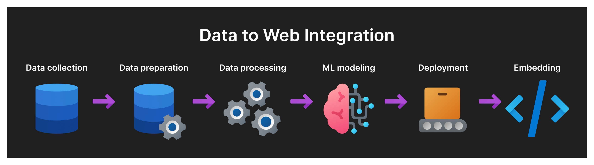

# Staccidentanalysis
Python US Accident Analysis and Prediction Web App - This repository contains a web application built with Python and the Streamlit framework. The app analyzes and predicts the likelihood of accidents in the United States using machine learning algorithms and open-source datasets

## Our Team
- [Andrew Virya Victorio](https://github.com/AlphaByte-RedTeam)
- [Feri Andika](https://github.com/your-feritale)
- [Eric Wiyanto](https://github.com/wiyantoeric)
- [Janice Claresta Lingga](https://github.com/janeclrst)

## The Process

